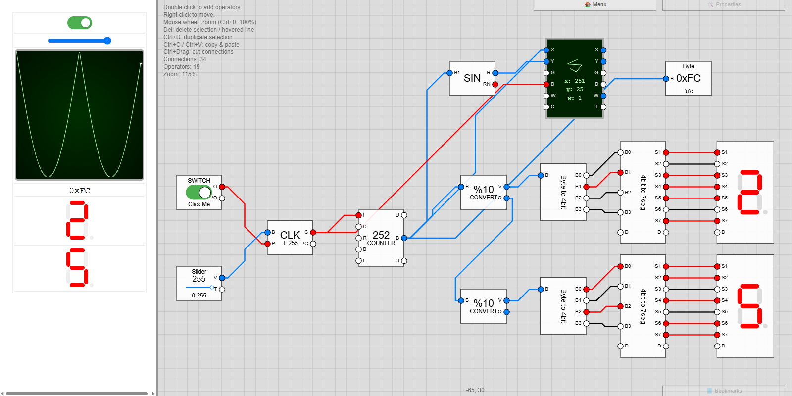

<div align="center">

# OperatorsV2

**A visual logic and dataflow editor that runs entirely in your browser.**

Place operators on a canvas, wire them together, and watch values flow through the
wires like electricity through cables — from a single light switch to a counter, a
plotter, or a small radio station.

[](https://operators.derdere.de/)

[](LICENSE)
[](#the-operators)
[](https://operators.derdere.de/wiki.html)
[](#running-it-yourself)

</div>



<div align="center"><sub>A clock drives a counter. Its value is plotted as a sine curve on the
line display, shown as hex and as a character, and split into decimal digits for two seven
segment displays. This circuit is in <a href="dev/readme-screenshot-circuit.json"><code>dev/readme-screenshot-circuit.json</code></a> — load it via <b>📂 Open File</b>.</sub></div>

## What it is

Every circuit runs in tiny steps called **ticks**, dozens of them per second. In each
tick every block reads its inputs and sets its outputs anew, and each connection copies
one value from an output to an input. A value is either a **bit** (on/off) or a **byte**
(0–255) — the wire colour tells you which: red is on, black or white is off, blue carries
a number.

That is the whole model. Everything else is built from it.

- **Nothing to install.** It is a web page. Open it and start building.
- **No account, no cloud.** Circuits are saved as JSON files on your own machine.
- **Learn as you go.** A built-in wiki explains bits, edges, stacks and vectors from
  scratch — with live, running circuits embedded right in the pages.

## Features

| | |
| --- | --- |
| **68 operators in 13 categories** | Logic gates, flip-flops, counters, registers, stacks, math, vectors, converters, displays, portals … |
| **Live canvas** | Pan, zoom, grid snapping, rubber-band selection, copy/paste, and cut-through wire slicing |
| **Five wire styles** | Straight, two Bézier flavours, a fan, and a real A\* printed-circuit router that traces right-angle paths around the blocks |
| **Screens and readouts** | Seven segment digits, a line-drawing display, a text terminal, lamps, and formatted byte views (bin/oct/dec/hex/char) |
| **Sound** | A Web Audio voice per block: note, volume, length, waveform, trigger and hold — all of them inputs, so a circuit can play a melody |
| **Radio channels** | Network sender/receiver blocks exchange bytes live over WebSocket channels, so two browsers can talk to each other |
| **Files** | Read bytes out of a file into a circuit, and write bytes back out to one |
| **Bilingual wiki** | 73 pages each in German and English, with full-text search and runnable demos |
| **Guided tours** | An 11-step introduction that builds a counter with you, and a 17-step advanced tour that builds a working radio station |

## The operators

| Category | Blocks |
| --- | --- |
| **Math** (12) | Add, Subtract, Multiply, Divide, Modulo, Scale, Equals, Sinus, Cosinus, Tangents, Random, Noise |
| **Logic** (8) | And, Or, Xor, Not, Select, Pulse, RS FlipFlop, T FlipFlop |
| **Utility** (7) | Pipe 1, Pipe 4, Pipe 8, Portal 1 Entry, Portal 4 Entry, Portal 8 Entry, Portal Exit |
| **Memory** (6) | Counter4, Counter8, Memory (1 bit), Memory (1 byte), Register, Stack |
| **Vector** (6) | Vector Add, Vector Subtract, Vector Multiply, Vector Scale, Vector Modulo, Vector Rotate |
| **Converter** (6) | Byte to 4bit, Byte to 8bit, 4bit to byte, 8bit to byte, 4bit to 7 Segment, Base Converter |
| **User Input** (5) | Switch, Button, Slider, Text Input, File Input |
| **Display** (5) | Lamp, Byte, 7 Segment Display, Line Display, Terminal Display |
| **Signal** (4) | Clock, Tick, Repeater, Time |
| **Organisation** (3) | Comment, Label, Anchor |
| **User Output** (2) | Sound, File Output |
| **Network** (2) | Network Sender, Network Receiver |
| **Fixed Input** (2) | Value, Stack Input |

Double-click the canvas to pick one. Every block is documented in the wiki, with a demo
you can actually operate.

## Documentation

The [wiki](https://operators.derdere.de/wiki.html) is the teaching half of this project.
It assumes no prior knowledge of electronics or programming and starts at the beginning:

- **First Steps** — open the editor and build your first circuit
- **Editor Controls** — every mouse and keyboard command
- **Values and Signals** · **Bits and Bytes** · **Edges and Clock**
- **Stack and Queue** · **Vectors** · **Negative Numbers and Overflow**
- **Operator Reference** — all 68 blocks in detail

Its pages are plain Markdown under [`wiki/`](wiki/), one tree per language with identical
file paths. Code blocks tagged `operatorsv2` hold a saved circuit and are turned into
live, running demos when the page is rendered.

## Running it yourself

The stack is driven entirely through the Makefile. Docker Desktop has to be running.

```sh
make start   # create .env from env.example, build the image, start the container
make wait    # block until the server reports healthy
make open    # open the app in your browser
```

`make` on its own prints every available command. Others are `make logs`, `make stop`,
and `make server_refresh` (rebuild the wiki search index of a running server without
restarting it).

You can also just **open `www/index.html` straight from disk** — the editor is plain
static files and needs no server. Only the bundled examples and the wiki depend on one.

## How it is built

No frameworks, no bundler, no package manager on the frontend — classic `<script>` tags
and globals, so you can read any file and know what it does.

| Path | What lives there |
| --- | --- |
| [`www/`](www/) | The application: p5.js canvas, operators, wires, GUI |
| [`wiki/`](wiki/) | The documentation, as Markdown, one tree per language |
| [`server/`](server/) | A slim Node web server: static files, wiki rendering, search index, WebSocket radio channels |
| [`dev/`](dev/) | Circuits behind the screenshots and tours, kept loadable |
| [`tools/`](tools/) | Python helpers behind the Makefile targets |

The server has exactly two npm dependencies — [`marked`](https://marked.js.org/) for
Markdown and [`pagefind`](https://pagefind.app/) for the search index, which is built in
memory at startup. The WebSocket layer (RFC 6455) is implemented from scratch, and the
`dat.gui` panel library is a fork maintained inside the repo.

## Contributing

Adding an operator is one call to `register(name, category, description, class)` in a
file under `www/js/operators/`, plus a `<script>` tag in `www/index.html` and
`www/wiki.html`. The block's logic goes into `doUpdate`: read the inputs, set the
outputs. [`CLAUDE.md`](CLAUDE.md) describes the architecture in depth.

## License

OperatorsV2 is free software, licensed under the
**[GNU General Public License v3.0](LICENSE)**.

You may use, study, share and modify it. If you distribute it, or a modified version,
it has to stay under the same license and the source has to come with it. The program
is provided without any warranty. See [`LICENSE`](LICENSE) for the full text.
